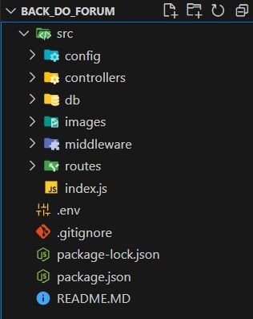

# SPADIUM'S - BACKEND

Bem-vindo ao SPADIUM'S - Backend! Este é um projeto desenvolvido em Node.js com Express e PostgreSQL. Aqui você encontrará operações CRUD completas além de filtros.


## Funcionalidades🪄

- Criação, leitura, atualização e exclusão (CRUD) de contatos:
   - Adicionar contato;
   - Obter todos os contatos;
   - Atualizar contato específico;
   - Deletar contato específico;
   - Obter contato específico por ID, email, telefone e nome.
     
- Criação, leitura, atualização e exclusão (CRUD) de avaliações:
   - Adicionar avaliação;
   - Obter avaliações de restaurante específico.
   
- Criação, leitura, atualização e exclusão (CRUD) de tipos de cozinha:
   - Adicionar tipo de cozinha;
   - Obter todos os tipos de cozinha;
   - Atualizar tipo de cozinha;
   - Deletar tipo de cozinha.
     
- Criação, leitura, atualização e exclusão (CRUD) de favoritos:
   - Adicionar restaurante aos favoritos;
   - Remover restaurante dos favoritos;
   - Obter todos os restaurantes favoritos.
     
- Autenticação de usuários:
   - Login de usuário.
     
- Criação, leitura, atualização e exclusão (CRUD) de restaurantes:
   - Adicionar restaurante
   - Obter todos os restaurantes
   - Atualizar restaurante
   - Deletar restaurante
   - Obter restaurante pelo ID
- Criação, leitura, atualização e exclusão (CRUD) de usuários:
   - Adicionar usuário
   - Obter todos os usuários
   - Atualizar usuário
   - Deletar usuário
   - Obter usuário pelo ID

## Tecnologias Utilizadas🪄

- Node.js
- Express
- PostgreSQL
- dotenv


## Como Usar🪄

1. Clone este repositório:

```
git clone https://github.com/vilasboasfabio/back_do_forum.git
```

2. Instale as dependências:

```
npm install
```

3. Configure o banco de dados PostgreSQL:

   - Certifique-se de ter o PostgreSQL instalado em sua máquina.
   - Crie um banco de dados chamado `spadium`.
   - Execute o script fornecido em `database.sql` para criar as tabelas.

4. Configure as credenciais do banco de dados:

   - No arquivo index.js, modifique as configurações de conexão do pool do PostgreSQL para refletir suas credenciais.

5. Inicie o servidor:

```
npm run dev
```

6. Acesse a API em `http://localhost:3000`.

## Rotas 🪄

- Contatos:
   - POST /contatos: Adiciona um novo contato.
   - PUT /contatos: Atualiza um contato existente.
   - DELETE /contatos: Deleta um contato existente.
   - GET /contatos/:id: Retorna um contato pelo ID.
   - GET /contatos/:email: Retorna um contato pelo email.
   - GET /contatos: Retorna todos os contatos.
     
- Avaliações:
   - POST /review: Adiciona uma nova avaliação (autenticado).
   - GET /reviews/:restaurantId: Retorna todas as avaliações de um restaurante específico.
     
- Cozinhas:
   - POST /cuisine-types: Adiciona um novo tipo de cozinha.
   - GET /cuisine-types: Retorna todos os tipos de cozinha.
   - PUT /cuisine-types/:id: Atualiza um tipo de cozinha existente.
   - DELETE /cuisine-types/:id: Deleta um tipo de cozinha existente.
     
- Favoritos:
   - POST /favorites: Adiciona um restaurante aos favoritos (autenticado).
   - GET /favorites: Retorna os restaurantes favoritos (autenticado).
   - DELETE /favorites: Remove um restaurante dos favoritos (autenticado).
     
- Login:
   - POST /login: Realiza o login de um usuário.
   - Restaurantes
   - POST /restaurants: Adiciona um novo restaurante (com upload de fotos).
   - GET /restaurants: Retorna todos os restaurantes.
   - PUT /restaurants/:id: Atualiza um restaurante existente (com upload de fotos).
   - DELETE /restaurants/:id: Deleta um restaurante existente.
   - GET /restaurants/:id: Retorna um restaurante pelo ID.
     
- Usuários:
  - POST /usuarios: Adiciona um novo usuário.
  - GET /usuarios: Retorna todos os usuários.
  - PUT /usuarios/:id: Atualiza um usuário existente.
  - DELETE /usuarios/:id: Deleta um usuário existente.
  - GET /usuarios/:id: Retorna um usuário pelo ID.
  - GET /usuarios/email/:email: Retorna um usuário pelo email.
  - GET /usuarios/type/:type: Retorna usuários pelo tipo.
  - GET /usuarios/name/:name: Retorna usuários pelo nome.

## Estrutura de pastas 🪄


A organização de pastas em um projeto de software é essencial para a organização, escalabilidade e manutenção do código. Uma estrutura bem planejada permite que os desenvolvedores localizem facilmente o código responsável por funcionalidades específicas, facilita a implementação de mudanças e ajuda na integração e teste de novas funcionalidades. No caso de uma API construída com Node.js e Express, as pastas geralmente incluem routes, controllers, config, entre outras conforme a necessidade do projeto. A seguir, explicamos como essas partes se comunicam e qual é a função de cada uma:
1. /config
   - Armazena arquivos de configuração, como conexões de banco de dados.
   - `dbConfig.js` é um exemplo, onde você configura e exporta o pool de conexões PostgreSQL para ser usado em outras partes do aplicativo.

2. /controllers
   - Contém lógica de negócios para manipular as requisições e respostas.
   - Os controllers importam configurações de `/config` para acessar o banco de dados.
   - Eles definem funções para cada operação CRUD, que são então exportadas para serem usadas pelas rotas.

3. /routes
   - Define as rotas HTTP que o aplicativo irá responder.
   - As rotas utilizam os controllers para encaminhar a lógica de processamento das requisições.
   - Cada rota especifica um caminho e associa este caminho a uma função específica em um controller.

4. index.js
   - É o ponto de entrada do aplicativo, onde o servidor é configurado e iniciado.
   - Utiliza as definições de rotas para encaminhar as requisições para os handlers apropriados.
   - Carrega configurações globais, como middlewares e variáveis de ambiente.
As pastas e arquivos interagem principalmente através de importações e exportações, permitindo que funcionalidades específicas sejam modularizadas e gerenciadas de forma independente. 
Esta organização não só mantém o código limpo e legível, mas também facilita a expansão e manutenção ao permitir que novos desenvolvedores compreendam rapidamente a estrutura e funcionamento do projeto.


